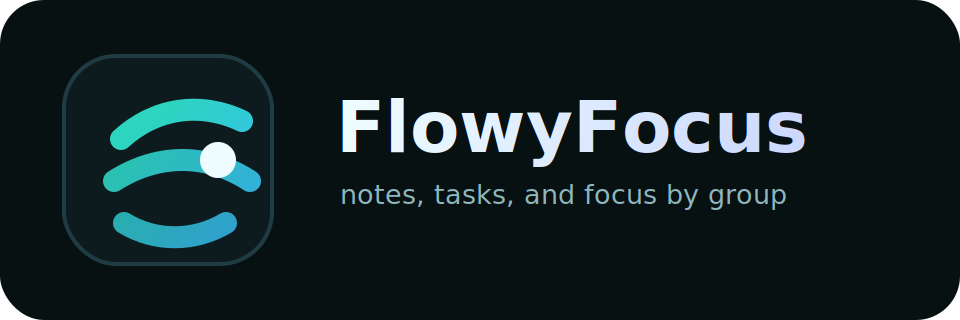

# FlowyFocus



A calm, single-group-at-a-time notes and to-do app.

**Live site:** <https://personal-notes.vercel.app>

- **Frontend:** Vite + React + TypeScript → deployed on **Vercel**
- **Backend:** **Supabase** (Postgres + Auth + Row-Level Security) — no server to run
- **Login:** Google (Gmail) via Supabase Auth
- **Core idea:** organise everything into **groups** (Car, Work, Surfing…) and
  view exactly one group at a time, full-screen, distraction-free.

See [DECISIONS.md](DECISIONS.md) for the full design rationale.

---

## Features

- **Group-focused workspace:** organise notes and tasks by group, then focus on one group at a time.
- **Kanban task board:** move tasks between To do, In progress, and Done with drag and drop.
- **Task details:** add priorities, due dates, descriptions, subtasks, and attached images.
- **Pomodoro timer:** keep a focused work rhythm inside the same workspace.
- **Progress dashboard:** scan group stats, workload, and completion signals at a glance.
- **Autosaved notes:** write notes per group with Supabase-backed persistence.
- **Secure accounts:** sign in with Google or email/password through Supabase Auth and RLS.

---

## Screenshots


---

## 1. Create the Supabase project

1. Go to <https://supabase.com> → **New project**. Note the project URL and the
   `anon` public API key (Project Settings → API).
2. Open **SQL Editor → New query**, paste the contents of
   [supabase/schema.sql](supabase/schema.sql), and **Run**. This creates the
   `groups`, `tasks`, and `notes` tables plus the Row-Level Security policies.

## 2. Enable Google login

1. Create a Google OAuth client:
   <https://console.cloud.google.com> → APIs & Services → Credentials →
   **Create Credentials → OAuth client ID → Web application**.
2. Under **Authorized redirect URIs**, add the callback shown in Supabase:
   `https://<your-project-ref>.supabase.co/auth/v1/callback`
3. Copy the Client ID + secret into Supabase:
   **Authentication → Providers → Google** → enable and paste them.
4. In Supabase **Authentication → URL Configuration**, set the **Site URL** to
   your Vercel URL (and `http://localhost:5173` while developing — add it under
   *Redirect URLs*).

## 3. Run locally

```bash
cp .env.example .env       # then fill in your Supabase URL + anon key
npm install
npm run dev                # http://localhost:5173
```

## 4. Deploy to Vercel

1. Push this folder to a Git repo and **Import** it at <https://vercel.com>.
2. Framework preset: **Vite** (build `npm run build`, output `dist`).
3. Add the two environment variables (Project → Settings → Environment Variables):
   - `VITE_SUPABASE_URL`
   - `VITE_SUPABASE_ANON_KEY`
4. Deploy. Then add the live Vercel domain to Supabase **Site URL / Redirect URLs**.

> The `anon` key is safe to expose in the browser — every table is locked down by
> Row-Level Security, so users can only ever read/write their own rows.

## Project structure

```
src/
  context/AuthProvider.tsx   Google auth + session
  hooks/                     useGroups / useTasks / useNotes (data layer)
  components/
    Login.tsx                Google sign-in screen
    GroupSwitcher.tsx        collapsible group rail
    GroupFocus.tsx           the one-group full-screen focus view
    KanbanBoard.tsx          To do / In progress / Done columns + drag & drop
    TaskCard.tsx             draggable task card
    TaskEditor.tsx           task detail modal (status/priority/due/checklist)
    NotesPanel.tsx           per-group notes with autosave
  lib/supabase.ts            Supabase client
  types.ts                   shared types
supabase/schema.sql          DB schema + RLS
```
